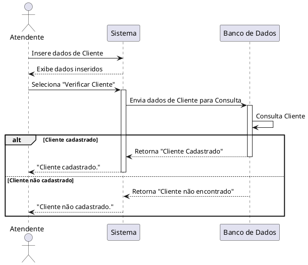
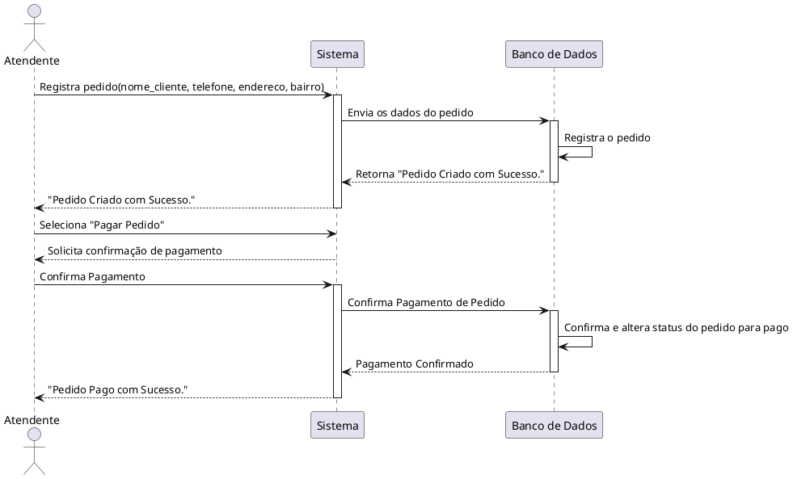

# 📌 Review de Diagramas de Sequência (PlantUML)

Este documento reúne todas as dúvidas esclarecidas e correções feitas nos diagramas de sequência utilizando PlantUML. Ele pode ser usado como um guia de referência rápida.

---

## 🎯 **Conceitos Importantes**

### **1️⃣ Setas em PlantUML**
| Tipo de Seta   | Significado |
|---------------|------------|
| `->`   | Comunicação normal |
| `-->`  | Comunicação síncrona (resposta direta) |
| `-->>` | Comunicação assíncrona (sistema pode continuar rodando sem esperar resposta) |
| `-->` e `-->>` | Diferença: `-->` bloqueia até receber resposta, `-->>` não |

### **2️⃣ Tempo de Ação (`activate` e `deactivate`)**
- **Indica quando um participante está ativo (processando algo).**
- Deve ser usado **somente quando o participante está realizando uma ação/processamento**.
- Não é necessário ativar um ator (como um usuário) porque ele apenas envia comandos.
- Exemplo:
  ```plantuml
  participant "Sistema" as Sys
  activate Sys
  Sys -> "Banco de Dados": Consulta Cliente
  deactivate Sys
  ```

### **3️⃣ Uso de `alt` para decisões**
- Quando há um **fluxo condicional**, usamos `alt`, `else`:
  ```plantuml
  alt Cliente cadastrado
      DB --> Sys: Retorna "Cliente Cadastrado"
  else Cliente não cadastrado
      DB --> Sys: Retorna "Cliente não encontrado"
  end
  ```

---

## ✅ **Correções e Melhorias nos Diagramas**

### **🔹 Correção do "Verificar Cliente"**
**Erros corrigidos:**
- Alteração da seta `-->>` para `-->`.
- Adição de `deactivate Sys` no fluxo "Cliente não cadastrado".



---

### **🔹 Correção do "Pagar Pedido"**
**Erros corrigidos:**
- Nome do diagrama estava errado (`Verificar Cliente` → `Pagar Pedido`).
- `activate DB` desnecessário após `DB --> Sys: Pagamento Confirmado`.
- Faltava `deactivate DB` após confirmação do pagamento.



---

## 🔥 **Resumo Final**
✅ **Uso correto de setas** (`-->` síncrona, `-->>` assíncrona).
✅ **Aplicação correta de `activate` e `deactivate`**.
✅ **Correção de fluxos condicionais (`alt` e `else`)**.
✅ **Correções nos nomes dos diagramas e melhorias na estrutura**.

Com essas melhorias, seus diagramas estão **bem estruturados, organizados e corretos!** 🚀👏

Se precisar de mais alguma revisão ou tiver novas dúvidas, só chamar! 😃

